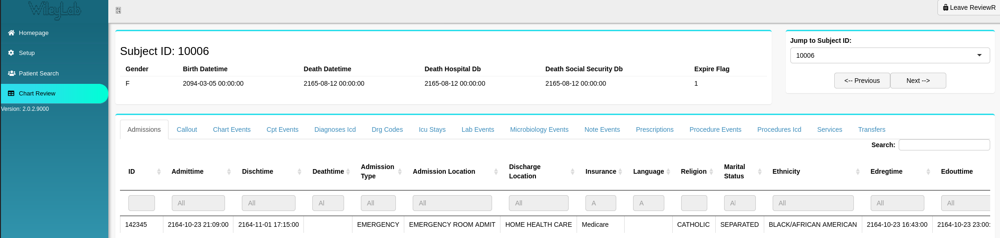

```{r, include = FALSE}
knitr::opts_chunk$set(
  collapse = TRUE,
  comment = "#>"
)
```

## Overview

Currently, ReviewR is capable of displaying patient information from databases that conform to the MIMIC3 and OMOP data models. However, we recognize that there are other patient data models that you may wish to connect to.  ReviewR has been designed to be extended to support the display additional data models. Further, customization of existing supported data model displays is also possible. 

### Flexibility

ReviewR is capable of working with patient databases that may differ *slightly* from the official specification. For example, in the MIMIC3 specification, demographic information can be found in the 'PATIENTS' table (upper case). Using the ReviewR's `user_table()` function, it is possible to request the 'PATIENTS' table from the connected database, even if the table is stored as 'patients' (lower case). Table fields may be requested in a similar fashion, using the `user_field()` function. 

### Requirements

In order for ReviewR to display patient data stored in other data models, ReviewR requires two things: 

* The included data model detection module must be able to identify the data model of the connected database
* A developer must create data model table functions, used to display the detected data model

These requirements will be discussed in the sections that follow.

### Data Model Detection

Using the connection information supplied by a database connection module, ReviewR will query a user database and attempt to determine the data model and data model version, if applicable. ReviewR will then match the connected tables and fields with the data model specifications that have been built into the package. The data model that has the most matching tables/fields will be identified as the currently connected data model. This will enable ReviewR to locate table functions that have been built into the package that correspond to the detected data model.

To see a list of available database specifications in ReviewR, run:
```{r}
library(ReviewR)
ReviewR::supported_datamodels
```
A data frame with 4 columns will be returned, indicating the file path[*](#file-path) of the data source, the data model name, the data model version, and data column containing a nested data frame with the schema of the data model itself. This schema information comes from CSV files that can be built into the ReviewR package.

This schema files must contain two columns, called `table` and `field`, which identify every field for every table in the data model and are used in the table/field comparison for the connected database. They are often available from the developer of the data model. If a schema file is available for your database, but contains additional descriptors it may still be used, but additional descriptors will be ignored. The schema file for the OMOP CDM v5.3.0 is provided as an example:

```{r echo=FALSE}
suppressMessages(library(magrittr))
ReviewR::supported_datamodels %>% 
  dplyr::filter(datamodel == 'omop', model_version == 'v5.3.0') %>% 
  tidyr::unnest(cols = data) %>% 
  dplyr::ungroup() %>% 
  dplyr::select(table, field) %>% 
  DT::datatable()
```

*Table: OMOP v5.3.0 Schema obtained from [OHDSI](https://github.com/OHDSI/CommonDataModel/releases/tag/v5.3.0)*

See the [New Data Model Development](#new-data-model-development) section for information on how to add to the list of supported data models. 

***

<a name="file-path"></a>
\**Note: The data-raw file path is only available when cloning the ReviewR from GitHub, it is not available when installing the package.*

### Table Functions

Once ReviewR has determined data model and version of the user database, it will search within its own namespace for functions that can be used to render the information contained within the connected data model. These functions must be developed ahead of time. Table functions have a standard naming convention, which allows this look up to occur. Functions used to render patient tables must begin with `{data-model-name}_table_` and will end with the *name* of the table you would like to display. The *name* portion of the function name become the tab name on the Chart Review section of ReviewR:

```{r echo=FALSE}

```

&nbsp;
&nbsp;
&nbsp;

Two types of table functions must be developed when supporting a new data model, an "all_patients" table and "subject specific" tables. 

#### All Patients Table

The "all patients' table will be used to render the patients displayed in the 'Patient Search' Section of ReviewR. This function must have a very specific name:

* `{data-model-name}_table_all_patients`

Additionally, the "all patients" table function must be designed to accept two arguments from ReviewR:

* `table_map`: returned by the data model detection module
* `db_connection`: which is supplied by the database connection module

ReviewR will handle supplying this information, but the table functions must be coded to accept these two arguments.

Using MIMIC3 as an example, demographic information is contained within the 'PATIENTS' table. A potential 'all_patients' table would be:
```{r eval=FALSE}
mimic3_table_all_patients <- function(table_map, db_connection) {
  ReviewR::user_table(table_map, db_connection, 'PATIENTS')
}
```

#### Subject Specific Tables

"Subject Specific" tables will make up the tabs that appear in the Chart Review Section of ReviewR. Each table is filtered to contain information from the subject that has been selected in the Patient Search Section. These functions follow the naming convention as specified below:

* `{data-model-name}_table_{table-name}`

These table functions must be designed to accept 3 arguments:

* `table_map`: returned by the data model detection module
* `db_connection`: which is supplied by the database connection module
* `subject_id`: The selected patient identifier returned by the navigation module

```{r eval=FALSE}
mimic3_table_admissions <- function(table, db_connection, subject_id) {
  ReviewR::user_table(table_map, db_connection, 'ADMISSIONS') %>% 
    filter(!!as.name(ReviewR::user_field(table_map, 'ADMISSIONS','PATIENT_ID')) == subject_id)
}
```


## New Data Model Development

A convenience function has been built into ReviewR to assist in supporting additional data models, `dev_add_datamodel`. This function will add a CSV file containing schema information into the data model detection module within ReviewR. Additionally, it will create a .R file with skeleton table functions for all tables identified within the supplied CSV file. 

This allows for a developer to customize the representation for each table in the data model they wish to support. 
