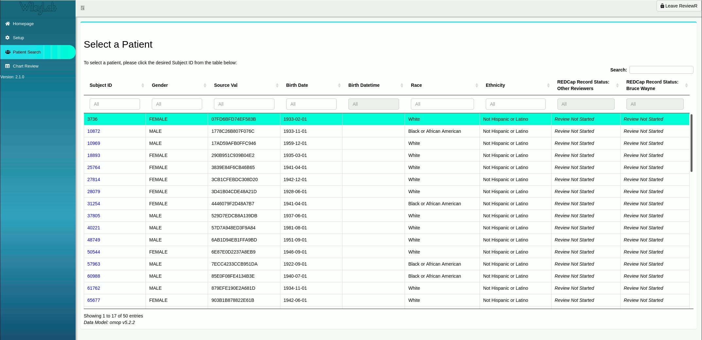

```{r, include = FALSE}
knitr::opts_chunk$set(
  collapse = TRUE,
  comment = "#>"
)
```

## Overview

Now that we have connected to patient records and established a REDCap project and connection, we can begin our chart review. To review previous setup steps, please see: 

* `vignette('connect_to_patient_records')`
* `vignette('connect_to_redcap')`

## Patient Search

Begin by opening the 'Patient Search' section and identifying a patient to review. To locate a particular patient you may search by any of the available fields by entering a search term in the box at the top of each column, or search globally across all columns by utilizing the search box in the upper right. The right most columns indicate the review status of each individual in the connected dataset. As you review subjects and upload information to REDCap, or other project users complete reviews, these columns will update indicating the current review status of each subject. Once you have selected a patient of interest, click the subject ID to be taken to the 'Chart Review' section.

```{r figure_1, echo=FALSE, fig.cap = "*Patient Tab displaying a [50 person subset](https://github.com/thewileylab/synPUF) of the CMS 2008-2010 Data Entrepreneurs’ Synthetic Public Use File (DE-SynPUF) from OHDSI.*", fig.align="center"}

```

## Chart Review

Clicking a subject ID from the 'Patient Search' section will automatically redirect you to the 'Chart Review' portion of ReviewR. Here, you will be greeted by a screen similar to this:

```{r figure_2, echo=FALSE, fig.cap = "*ReviewR Chart Review: Everything's [Shiny](https://shiny.rstudio.com/), Cap'n. Not to fret.*"}
knitr::include_graphics('reviewr_chart_review.png')
```

### Subject Header

### Jump to Subject ID

### Patient Chart

### REDCap Instrument
