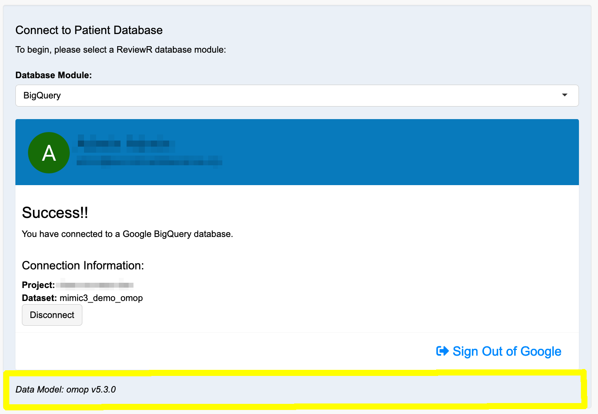
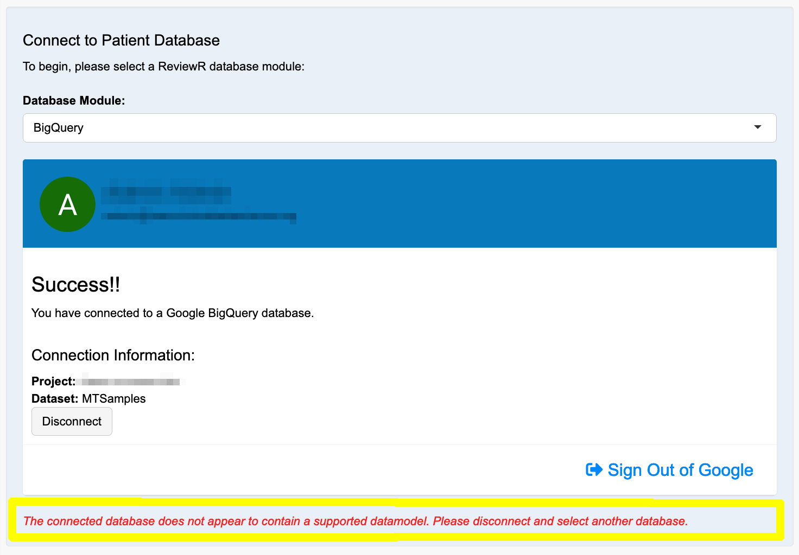

```{r, include = FALSE}
knitr::opts_chunk$set(
  collapse = TRUE,
  comment = "#>"
)
```

## Getting Started

Launch the ReviewR application by running `ReviewR::run_app()` from the R console or by visiting the URL of a Shiny Server deployed instance of ReviewR in a browser. On launch, ReviewR will show you the Homepage, which will provide some basic information about the ReviewR package. 

When you are ready to begin using ReviewR select the "Setup" option from the naviation menu on the left side of the application. The Setup section is divided into 2 columns, [Connect to Patient Database](#connect-to-patient-database) and [Configure Patient Chart Abstraction](https://reviewr.thewileylab.org/articles/usage_connect_to_redcap.html). 

## Connect to Patient Database

ReviewR supports multiple database systems. A listing of available database modules is displayed in the drop down menu, located in this section:

```{r figure_1, echo=FALSE, fig.cap="*Select from available database modules.*", fig.align='center'}
knitr::include_graphics('connect2db.png')
```

Select the database module that you would like to connect to. 

#### Google BigQuery 

If you are connecting to Google BigQuery, you will simply click "Sign In with Google". See [Google BigQuery Deployment](https://reviewr.thewileylab.org/articles/deploy_bigquery.html) for more information. 

Once you have successfully authenticated with Google you can select from your associated Google Cloud projects and the BigQuery data sets available within the selected project. Once you have selected the data set you wish to review, click "Connect".

#### PostgreSQL

If you are connecting to PostgreSQL you will be prompted for configuration information about your database (database name, hostname, and port) as well as your login information (username and password) then click "Connect".

#### Demo SQLite Database

If you would simply like to try ReviewR without connecting to your own data you can select the "Demo SQLite" database module and click "Connect". This demo database contains simulated patient data from the [CMS Synthetic Public Use File (SynPUF)](https://www.cms.gov/Research-Statistics-Data-and-Systems/Downloadable-Public-Use-Files/SynPUFs/DE_Syn_PUF) and [MTSamples](https://www.mtsamples.com) databases.

#### Other Relational Database Systems

If you would like to connect ReviewR to a dataset stored in a different relational database system, see the [Support a New Relational Database Management System](https://reviewr.thewileylab.org/articles/support_new_rdbms.html) vignette.


## Data Model Detection

Once the required database credentials have been provided, the database setup module will create a connection to your database and attempt to identify the data model of the patient data stored in your database. The connection information and detected data model will be shown in the successful connection pane:

```{r figure_3, echo=FALSE, fig.cap="*Successful connection to database with supported data model.*", fig.align='center'}

```

In the event that the data model cannot be determined, ReviewR will notify you with the following error message, indicating that data model support has not been add for your particular patient dataset. 

```{r figure_2, echo=FALSE, fig.cap="*Error when connecting to a database with an unsupported data model.*", fig.align='center'}

```

See the [Support a Custom Data Model](https://reviewr.thewileylab.org/articles/support_newdatamodel.html) vignette to learn how to add support for your particular dataset. 

## Next Steps

ReviewR is now ready for you to view the patient information contained within your database. If you would like to configure chart abstraction using REDCap, please see the [Connect to REDCap](https://reviewr.thewileylab.org/articles/usage_connect_to_redcap.html) vignette. Otherwise you can learn how to review patient charts in the [Perform a Chart Review](https://reviewr.thewileylab.org/articles/usage_perform_chart_review.html) vignette.

