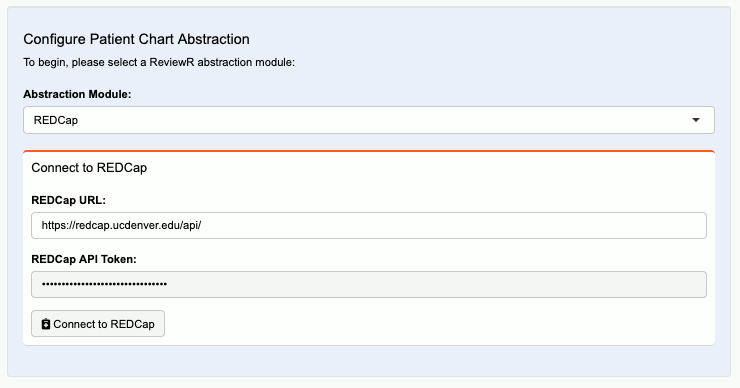
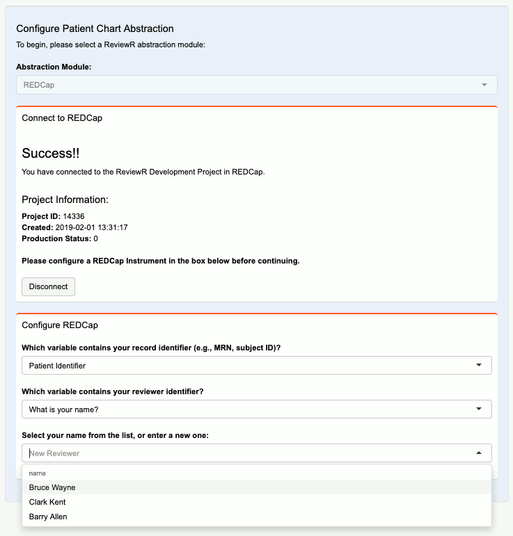
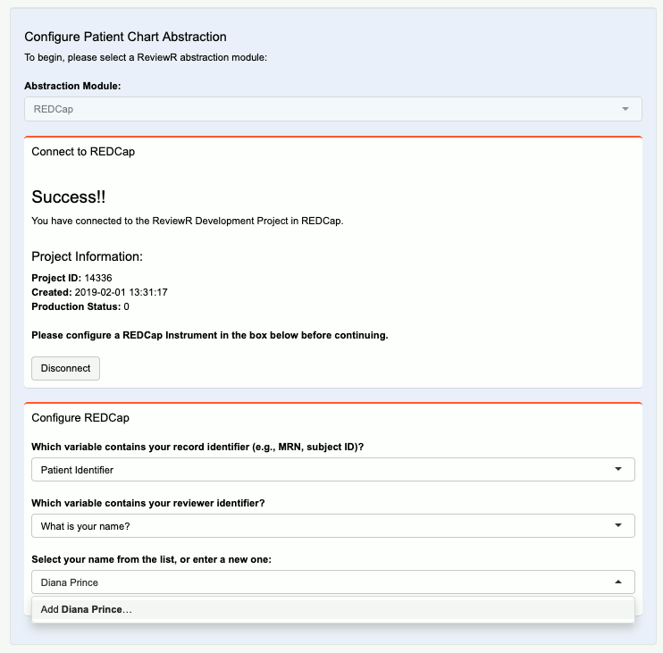
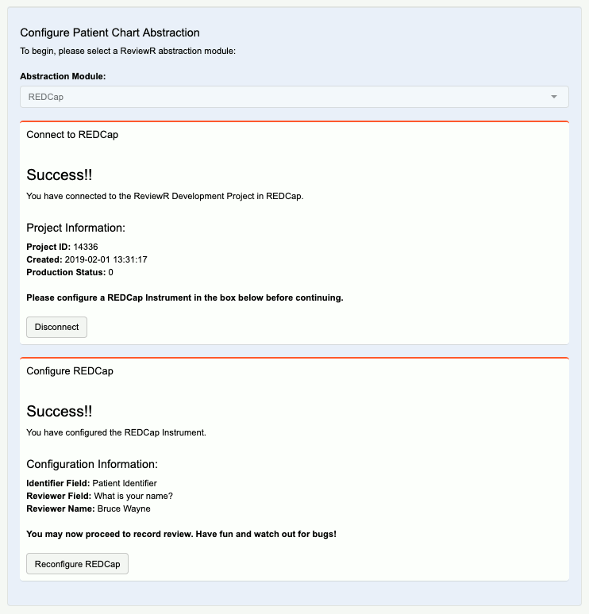

```{r, include = FALSE}
knitr::opts_chunk$set(
  collapse = TRUE,
  comment = "#>"
)
```

## Getting Started

In order to save information about individual records during your review, you will want to connect ReviewR to REDCap. Please note that this requires that you have access to REDCap through your institution and to set up an approved REDCap project that has access to an API key. 

## Create a REDCap Project

To begin, create a REDCap project on your institution's REDCap instance. Add any users that you would like to be able to access this project, and ensure that their permissions include:

* Data Export Tool: Full Data Set
* API: Import
* API: Export
* Create Records

Once users have been added and permissions set, have users log into the project, and request API access to the project. Each user will require _their own_ API key to access the abstraction functionality of ReviewR. 

## Design REDCap Instrument/s

After your project has been initialized with users added and API keys have been provisioned, you'll have to design an instrument for your REDCap project. Your institution should have resources to help teach you how to complete this step. There are a few considerations you should know for compatability with ReviewR. 

#### Required Field to Include

In order to link your review to the individual chart being reviewed you need to include a field to capture the record identifier (e.g., the stable identifier associated with each unique record/patient in your dataset). This _required field_ should be created with the "Text Box (Short Test, Number, Data/Time, ..." data type in REDCap. 

#### Suggested Field to Include

Optionally, you may also want to record who _performs_ the review. This "Reviewer" identifier is not required to use ReviewR. However if you do wish to record who performed the review, please create this field with the "Text Box (Short Test, Number, Data/Time, ..." data type in REDCap. When you configure REDCap in ReviewR you will have the ability to enter the reviewer's name or select from previous reviewers who have submitted data to the project. 

#### Supported Instrument Types

ReviewR supports projects with either a single or multiple instruments. 

At this time ReviewR **_does not_** support longitudinal or repeating instruments, nor does it support instruments that use conditional logic. 

#### Supported Field Types

When designing your instrument/s for use with ReviewR, please only include supported field types. Currently, ReviewR supports the following REDCap project field types:

```{r echo=FALSE, message=FALSE}
library(dplyr)
library(magrittr)
library(gt)
shinyREDCap::redcap_widget_map %>% 
  mutate(class = case_when(redcap_field_type %in% c('text', 'notes') ~ 'Text Field',
                           redcap_field_type %in% c('dropdown', 'radio') ~ 'Single Answer',
                           redcap_field_type %in% c('checkbox') ~ 'Multiple Answer',
                           redcap_field_type %in% c('yesno', 'truefalse') ~ 'Logical',
                           TRUE ~ 'Other'),
         redcap_field_val = case_when(redcap_field_type == "text" & is.na(redcap_field_val) ~ "None",
                                      redcap_field_val == "date_mdy" ~ "Date (M-D-Y)",
                                      redcap_field_val == "integer" ~ "Integer",
                                      TRUE ~ redcap_field_val),
         redcap_field_type = case_when(redcap_field_type == "text" ~ "Text Box (Short Text, Number, Data/Time, ...)",
                                       redcap_field_type == "notes" ~ "Notes Box (Paragraph Text)",
                                       redcap_field_type == "dropdown" ~ "Multiple Choice - Drop-down List (Single Answer)",
                                       redcap_field_type == "radio" ~ "Multiple Choice - Radio Buttons (Single Answer)",
                                       redcap_field_type == "checkbox" ~ "Checkboxes (Multiple Answers)",
                                       redcap_field_type == "truefalse" ~ "True - False",
                                       redcap_field_type == "yesno" ~ "Yes - No",
                                       TRUE ~ redcap_field_type)) %>% 
  group_by(redcap_field_type) %>% 
  summarise(redcap_field_val = paste(redcap_field_val, collapse = "; ")) %>% 
  gt() %>%
  cols_label(redcap_field_type = md('**REDCap Field Type**'), 
             redcap_field_val = md('**Supported Validation Options**'))
```


## Connect and Configure REDCap in ReviewR

Once you have set up your REDCap project as defined above, you are ready to connect to it from ReviewR. Load ReviewR either by visiting your institution's deployed URL, or by running `ReviewR::run_app()` from your local R installation. Head to the setup tab and connect to your patient data, using the 'Connect to Patient Database' pane (see [Connect to Patient Record Database](https://reviewr.thewileylab.org/articles/usage_connect_to_record_database.html)) vingette for more). 

### Connect to REDCap Project

You are now ready to connect to REDCap. From the 'Configure Patient Chart Abstraction' pane, select 'REDCap' from the Abstraction Module drop down. Next, enter your institution's REDCap API URL, and REDCap API key that was created for your REDCap project.

```{r figure_1, echo=FALSE, fig.cap="*Add REDCap Connection information.*", fig.align='center'}

```

After entering this information, click the 'Connect to REDCap' button. Note that the connect button will only appear after both a URL and API key are supplied. If the connection is successful, information about the connected project will be displayed including:

* REDCap Project ID
* Project creation date
* Production status

### Configure REDCap

Once a successful connection is made to a REDCap project a 'Configure REDCap' dialogue will appear. Here is where we will select the REDCap Question that will hold patient identifier. Additionally, if configured in your REDCap project, select which field should contain your reviewer information. 

One these fields are set, ReviewR will see if any information has been entered into the project. If previous information is found with a reviewer associated, it will populate a drop down with reviewers that may be selected. 

```{r figure_2, echo=FALSE, fig.cap="*Select from available reviewers.*", fig.align='center'}

```

If no previous information has been entered, or you would like to add a new reviewer, you may type a new name, and click 'Add'
```{r figure_3, echo=FALSE, fig.cap="*Add a new reviewer.*", fig.align='center'}

```

Once valid configuration selections have been chosen the 'Configure REDCap' button will appear. Click 'Configure REDCap' to save configuration values. Configured options will be presented for review. Upon successful configuration, review in progress status and your REDCap instrument will appear in ReviewR and you may now begin your manual record review. 
```{r figure_4, echo=FALSE, fig.cap="*Review selections when configured*", fig.align='center'}

```

## Disconnect/Reconfigure

At any point during the setup process, you may click 'Disconnect' to connect to a different REDCap project, or 'Reconfigure REDCap' to set new configuration options.

## Next Step

ReviewR is now ready for you to view and record information from the connected database. For information on how to perform a chart review, please see the (Perform A Chart Review)[https://reviewr.thewileylab.org/articles/usage_perform_chart_review.html] vignette for more. 